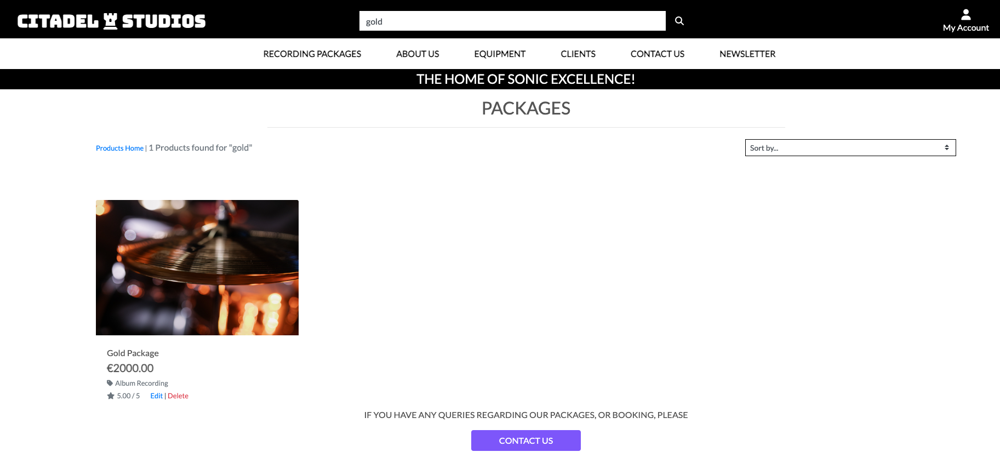
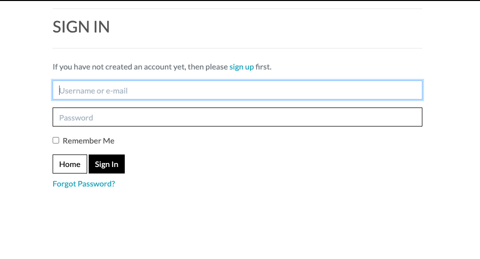
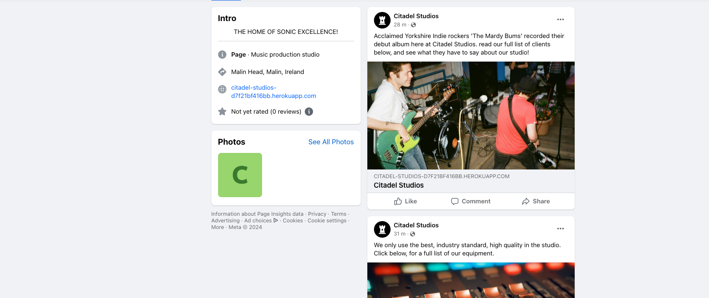
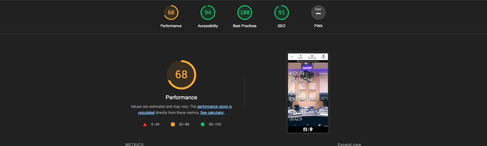

# Citadel Studios #

‘Citadel Studios’ is my final coursework submission for my studies at Code Institute. The site is an e-commerce site for a fictional recording studio in Donegal, Ireland. Site users can create profiles, order recording packages, read blog posts on the studio's equipment and client roster, fill out and submit a ‘Contact Us’ and ‘Newsletter’ form, and follow external links to the studio’s Facebook Business Page, and Google Maps address link. 


# Live Site - [Citadel Studios](https://citadel-studios-d7f21bf416bb.herokuapp.com/) #
### User Experience - UX #

### Agile Development

This site was created using the Agile Development structure. I would create a user story / issue and add it to my project in Github. I would then mark when the user story was in progress, then, finally, mark it as done and close the issue. 

### User Stories

* As a Site User, I can:

1. Navigate through the site. 
2. Register for a new user profile.
3. View packages that are available for purchase.
4. Add a package to my shopping bag. 
5. Edit or remove items from my shopping bag. 
6. Order and purchase a package using Stripe Payment. 
7. View confirmation of my purchase/order on the order confirmation page. 
8. View reviews for packages on their designated pages.
9. Read blog posts on the studio's equipment and client roster. 
10. Fill out a 'Contact Us' form.
11. Receive a success message when the form is submitted.  
12. Fill out a 'Newsletter' form. 
13. Receive a success message when the form is submitted. 
14. View the studio's Facebook Business Page, which opens in a new window, when the icon in the footer is clicked. 
15. View the studio's Google Maps address link, which opens in a new window, when the icon in the footer is clicked. 

* As a registered Site User, I can:

1. Log in to the site. 
2. Submit a review for a package on its designated page. 
3. Receive a success message when the review is submitted for approval.  
4. View my review once approved. 
5. Edit my review through the frontend site, if needs be. 
6. Delete my review through the frontend site, if needs be. 

* As a Site Admin, I can:

1. Create, edit, add images and links, and delete packages, blog posts, reviews, user profiles, and any correspondence or interactions with the site, in line with CRUD functionality. 
2. I can save blog posts as drafts, or publish them upon completion.

### Testing

Alongside the logging of my User Stories, I ran manual tests for each of them, and logged the results on a Microsoft Excel file. Here are my results:


### Agile Methodology

I completed my tasks by using the Agile method of task management. I found this method very helpful and rewarding to my work. I added User Story issues to my Github Projects tab on the site's repository page, which can be viewed [here](https://github.com/users/CathalSweeney6/projects/6).

### Site Goals

* To provide site users with a unique, engaging and slick e-commerce site. 
* To appeal to, and be visually interesting to all users and, not just those with an interest in music/music production. 
* To provide registered site users with the ability to interact with the site, through reviews on products. 
* To ensure that the site's design and stylings were responsive, clear and tidy on all screens and devices.
* To ensure that all links run and work fine on the site, and that a 404 page is displayed, should the user enter a typo when trying to navigate through their browser's searchbar. 
* To ensure that users are made aware that their purchases are secure, and that they receive clear confirmation of purchases/changes to their shopping bag. 

### Planning Out My Project

My plan for an e-commerce site, was for one that was slightly 'outside of the box,' in terms of site layout. I obviously wanted the site to include products for sale, but I also wanted the site to be engaging for users, in that they could read blog posts, and user reviews for products on the site, which, I believe, truly enhances the overall user functionality of the site. 

## Wireframe Design

Prior to writing any code, I began by designing my site's wireframe design through the mock-up software, Figma.com. 


## Typography 

The site's logo / main home link, was styled using the '[Bungee](https://fonts.google.com/specimen/Bungee?query=bungee)' font family, from [Google Fonts](https://fonts.google.com/?query=bungee).

The site features many different icons, which were taken from [Font Awesome](https://fontawesome.com/icons).

### Site Design and Layout

#### Colour Scheme 

I found a great royalty-free image of a recording studio, that is in the background of the majority of the site's pages. I used an eyedropper tool, to extract the RGB colour code from a certain light aspect of the image. I used this purple colour, taken from the original image, in the stylings of buttons, author tags, and hovering features in my site's css file. 


I stuck with simple blacks and whites for the remainder of the site styling, as I thought the simplistic, sleek look of the black and white, with the added dash of purple, here and there, really suited this style of website. 

#### Favicon Image

I made a favicon image based off of the chess piece icon that sits in the centre of the site's logo. This favicon image loads beside the site's title in the tab in the browser navbar. 


### Features 

#### Navbar

The navbar features the site's log/main home link, a link to the 'Recording Packages,' 'About Us,' 'Equipment,' 'Clients,' 'Contact Us,' and 'Newsletter' pages, as well as links to the user profile/login/register area, and a link to view the user's shopping bag. 


#### Tagline 

Below the navbar, across all pages on the site, sits the site's tagline, 'The Home of Sonic Excellence!' 


#### Searchbar 

Above the navbar, sits the searchbar, where users can search for a product in non-case sensitive terms. if the user clicks the search button but does not enter a search criteria, they are redirected to the products page, where an error message is displayed in the navbar. 




#### 'Book Now' Button 

On the site's homepage, the user can access the recording packages page, by clicking the link on the navbar, or by clicking the 'Book Now' button, below the blurb on the home page. 


#### Recording Packages Page

The user can view all four of the recording packages from this page. They can also access the site's navbar and searchbar, and can click the 'Contact Us' button at the bottom of the page, should they have any queries. Users can also filter their view of the packages, based on alphabetical order and price, through this page. 


#### Package Detail Page

The user can view a specific package through this page. They can choose a date and time for when they wish to avail of this package, which is mandatory. They can then add the package to their shopping bag. 


#### Reviews Section 

At the bottom of the package detail page, is the package review section, which is responsive and unique to each package. Users can read other user's reviews here. They can also submit their own, once they have created a user account. Users can submit the name that they wish to have displayed alongside their review, a rating from 1 - 10, through a dropdown menu selection, and finally, their review message. Users can then submit their reviews to the admins, and receive a success message when their review is submitted. 


#### About Us Page

Users can view a brief informatical blurb about the studio, its whereabouts and what services it offers to clients, through the 'About Us' page. They can also view the 'Contact Us' page, if they click the link at the bottom of the blurb. 


#### Equipment Blog Posts

Users can view the list of six equipment blog posts, through this page, they can select whichever post they wish and will be brought to the specific blog post's page when doing so.


#### Equipment Blog Post Detail Page

Each blog post contains a featured image, an author tag, and the date and time that the blog was first published. The blog posts consist of short blurbs and breakdowns of what equipment is available in the studio, per instrument. 


#### Client Blog Posts

Users can view the list of three client blog posts, through this page, they can select whichever post they wish and will be brought to the specific blog post's page when doing so.


#### Client Blog Post Detail Page

Each blog post contains a featured image, an author tag, and the date and time that the blog was first published. The blog posts consist of short blurbs and a quote from the fictional client, about their experience at the studio. 


#### Contact Us Page

Users can submit their name, email address, and message in this form. 


#### Contact Submission Success Page

When a user submits their 'Contact Us' form, they are directed to the success message page, that informs them that their correspondence has been submitted for view by the site admin. 


#### Newsletter Page

As part of the assessment criteria, students are required to "Add a newsletter signup form to your application." Users can submit their email address in this form, where their email address will be stored in the admin site. 


#### Newsletter Subscription Success Page

When a user submits their 'Newsletter' form, they are directed to the success message page, that informs them that their details have been submitted for view by the site admin. 


#### User Account / Signup / Login View

When the user clicks the 'My Account' button, they can login or register for a site account, view their account details, including previous order history, and logout, if desired. 


#### Register Account Page

Here the user can enter their details, and register to the site. Upon registering, they have created a new account and are greeted with a success message in the home page's navbar. 


#### Login Page

Here, users can enter their login details, and continue to the site. A login success message appears, upon successful login, on the home page's navbar. 



#### Logout Page

Here, the user is asked to confirm that they wish to logout of their account. Upon confirmation, the user is redirected to the home page, where a logout success message appears on the navbar. 


#### Shopping Bag

Users can view the items in their shopping bag here, as well as edit the item's quantity and remove items from their bag, if desired. If their bag is empty and the user views their bag, they can be directed to the recording packages page, through a link on the page. 


#### Checkout Page

Users can input their details on this page and succesfully checkout. 


#### Checkout Success Page

Users receive a message confirming their order on this page, they can also view a breakdown of their order confirmation on this page. 


#### Order Confirmation Email

If a user inputs a real/their actual email address during checkout, they will receive an order confirmation email in their inbox. PLEASE NOTE: These order confirmation emails can tend to be sorted directly in your spam/junk folder, upon inspection.  


#### Footer 

The site's footer features links to two external sites, that both open in new tabs. These sites are the studio's Facebook Business Page and the studio's Google Maps address link. 

#### Facebook Business Page

The Facebook Business Page was created using Facebook's 'Pages' tab. In order to create a Facebook Business Page, you must first have a Facebook account of your own.




#### Google Maps Link

The Google Maps link brings the user to a Google Maps page, for the fictional studio's fictional address. 


#### 404 Page

When the user enters the wrong address when trying to navigate through the site, using their browser's searchbar, they will be directed to the 404 Page, where they can access the navbar links, as well as being redirected to the packages page. 


### Superuser / Admin Site 

As a site Admin, I could create, edit and delete packages and blog posts on the site, as well as approve user reviews, and monitor and delete user profiles and email addresses, by using the built in Django administration site, for my project. 


## Database Diagram

I used LucidChart to create a Database Diagram for my project.


## Technologies Used 

### Site Languages

* HTML
* CSS
* Django
* JavaScript
* Python

#### Django Packages

* Gunicorn
* Cloudinary
* DJ-database-url
* Pyscopg2 
* Summernote 
* Allauth 
* Crispy Forms 

### Frameworks, and Misc. Libraries and Programs

* Gitpod
* Github
* Fontawesome
* Google Fonts
* PostgreSQL
* Google/Chrome Developer Tools
* Lucidchart
* Heroku 
* AWS 
* Stripe Payment Webhooks


### SEO 

To achieve proper SEO for my site, I inputted metatags into my site's main header, that refer to keywords associated and found throughout the site. I also included a Sitemap and robots.txt file, so that my site's links and layout could be sumbitted to Google for searching, and the files could be crawlable by Google Spiders. 

#### Amazon AWS

All static files were stored externally by AWS, Amazon Web Services. This is due to the fact that Heroku doesn't properly support static files. 

The setup for AWS, though initially, a daunting prospect is quite easy to do. It can be broken down very simply. 

* Sign up for an AWS account.
* Once logged in, head to the AWS Management Console. 

#### S3 Setup

- In AWS, search for 'S3'.
- In S3, create a new bucket, name it after your deployed Heroku name and pick your region. 
- Change the bucket's settings to public, in order for it to work with Heroku. 
- In 'Object Ownership,' enable 'ACLs', and select  'Bucket owner preferred.'
- In 'Properties,' switch on static website hosting, enter `index.html` and `error.html` into the requested fields, and click Save.
- In 'Permissions,' paste in the required CORS configuration (below):

	```shell
	[
		{
			"AllowedHeaders": [
				"Authorization"
			],
			"AllowedMethods": [
				"GET"
			],
			"AllowedOrigins": [
				"*"
			],
			"ExposeHeaders": []
		}
	]
	```
	
* Copy the ARN string.

* In 'Bucket Policy,' select 'Policy Generator,' and follow the below steps, in order:

<br>

1. Policy Type: S3 Bucket Policy
2. Effect: Allow
3. Principal: *
4. Actions: GetObject
5. Amazon Resource Name/ARN: your-ARN-goes-here.
6. Click 'Add Statement.'
7. Click 'Generate Policy.'
8. Copy the entire policy (below), and paste it into your 'Bucket Policy Editor.'


```shell
{
 	"Id": "Policy1234567890",
 	"Version": "2012-10-17",
 	"Statement": [
 		{
 			"Sid": "Stmt1234567890",
 			"Action": [
 				"s3:GetObject"
 			],
 			"Effect": "Allow",
 			"Resource": "arn:aws:s3:::your-bucket-name/*"
 			"Principal": "*",
 		}
 	]
 }
```

9. Add /* to the end of the Resource key in 'Bucket Policy Editor.'
10. Click 'Save.' 
11. In the Access Control List/ACL , click 'Edit' and enable public access. Accept the warning box.
12. Edit the Object Ownership section to ACLs enabled, if the edit button is disabled.


## IAM

* In the AWS 'Services Menu,' find and open IAM/Identity and Access Management. Then follow these steps, in order:

1. Click 'Create New Group' in 'User Groups.'
2. Suggested Name: Enter your group and project name here. 
3. Click 'Tags,' to proceed to the review policy page. Adding tags is optional. 
4. In 'User Groups,' select your new group, and then click the 'Permissions' tab.
5. Click the 'Add Permissions' dropdown, and then click 'Attach Policies.'
6. Select the policy, and when finished, click 'Add Permissions.'
7. From 'JSON' select 'Import Managed Policy.'
8. Search for S3, select the required policy, 'AmazonS3FullAccess,' and then click 'Import.'
9. Once again, copy the ARN (below) from the S3 Bucket copied and paste it into 'Resources.'

```shell
 {
 	"Version": "2012-10-17",
 	"Statement": [
 		{
 			"Effect": "Allow",
 			"Action": "s3:*",
 			"Resource": [
 				"arn:aws:s3:::your-bucket-name",
 				"arn:aws:s3:::your-bucket-name/*"
 			]
 		}
 	]
 }
```

10. Click 'Review Policy.'
11. Suggested Name: Your policy and project name go here. 
13. Add a description.
14. Click 'Create Policy.'
15. Click your group from 'User Groups.'
16. Click 'Attach Policy.'
17. Search for your new policy, select it, then 'Attach Policy.'
18. Click 'Add User' from 'User Groups.'
19. Suggested Name: Enter your user and project name here. 
20. For "Select AWS Access Type", select Programmatic Access.
21. Add your new user to the group.
22. Click 'Tags,' to proceed to the review policy page. Adding tags is optional. 
23. Click 'Create User.'
24. Click the button to download .csv, and save a copy of it to your system. You cannot download this again, so make sure it is downloaded successfully and stored securely. 
25. AWS_ACCESS_KEY_ID = Enter your access key ID here. 
26. AWS_SECRET_ACCESS_KEY = Enter your secret key here. 

### Final AWS Setup

1. Remove DISABLE_COLLECTSTATIC from your Heroku config vars.
2. Create a new folder called 'media,' in S3.
3. Align all required images that you wish to have stored in the 'media' folder, to then appear live on the deployed site. 
4. In 'Manage Public Permissions,' select 'Grant Public Read Access.'
5. Finally, click 'Upload.' 

## Stripe API

All e-commerce payments on this project/site are handled through Stripe Payments.

Create a new Stripe account and then, follow these steps, in order:

1. Click 'Get your test API keys,' in your dashboard. 
2. Retrieve your two keys, STRIPE_PUBLIC_KEY (starts with pk), and STRIPE_SECRET_KEY (starts with sk).
3. In your dashboard, click 'Developers'/'Webhooks.'
4. Click add endpoint and enter your Heroku site url and add the endtags /checkout/wh/ at the end of the url. 
5. Click 'receive all events.'
6. Click 'Add Endpoint.'
6. Retrieve your new STRIPE_WH_SECRET key (starts with wh).


## Gmail API

* You can use Gmail/Google to verify user logins and send confirmation emails to users. 
* Once registered/logged in to Gmail, follow these steps, in order:

1. Click 'Account Settings.'
2. Click 'Accounts and Import.'
3. In 'Change Account Settings,' click the settings for an 'Other Google Account.'
4. Select 'Security.'
5. Turn on 2-Step Verification to turn it on. 
6. Select 'Turn On.'
7. Head back to 'Security,' page, and then head to 'App Passwords.'
8. Select 'Mail.'
9. For the device type, select 'Other.'
10. Enter a custom name. 
11. Retrieve your 16-character API key. Save this key securely, as it cannot be accessed again. 
12. Retrieve your EMAIL_HOST_PASS 16-character API key, and the EMAIL_HOST_USER (the user's email address).


### Site Testing 

Testing was carried out extensively, whilst creating and publishing my site. As my project featured various different elements interacting with one another, I wanted to insure that everything ran correctly. I checked my site's console, and had zero issues. 


<br>
<br>
<br>


#### Browser Testing 

I created my website using Google Chrome. The site runs perfectly on the server. I also tested that each aspect of the site ran smoothly on Safari and Firefox. The site ran on all servers, with no errors or bugs. 

#### Lighthouse 

I tested my site on Google's 'Lighthouse' feature, which pointed out ways in which I could improve the website for a smoother load-time and better user experience on desktop, tablet and mobile. I took Lighthouse's advice on board and was delighted with my results. 



#### Validation 

I validated my sites html files and received no errors. 


I validated my sites css files and received no errors. 


I used the [Code Beautify Python Linter and Beautifier](https://codebeautify.org/python-formatter-beautifier#), and the [JSHint JavaScript Validator](https://jshint.com/), to validate my Python and JavaScript files, and received no errors.

# Setting Up a Django App

1. Firstly, open the [Code Institute Gitpod Full Template](https://github.com/Code-Institute-Org/gitpod-full-template). 
2. Use this template to create a new Github repository.  
3. Once the repository is set up, use the Github terminal to install Django and Gunicorn to your workspace, by entering in: `pip3 install 'django<4' gunicorn`.
4. Next install the database libraries, dj_database_url and psycopg2, by entering in: `pip3 install dj_database_url==0.5.0 psycopg2`.
5. Create a requirements file by entering in: `pip freeze --local > requirements.txt`.
6. Create your project, by entering in: `django-admin startproject desired_project_name_goes_here`.
7. Create your Django app, by entering in: `python3 manage.py startapp desired_app_name_goes_here`.
8. Enter your app's name into the list of installed apps, in your settings.py file.
9. Migrate changes to your project by entering in: `python3 manage.py migrate`.
10. Check to see if your Django app is successfully set up, by running the server, by entering in: `python3 manage.py runserver`.
11. By following these instructions, the app should be successfully set up. The server will show a 'successfully installed' message from Django. 

## Deployment to Heroku

1. Log in to your [Heroku](https://id.heroku.com) account, and select 'Create New App' from the menu. 
2. Enter your desired app name, then select your region, in order to create the app. 
3. Use ElephantSQL to create a database. Log in, create a new instance, and name your plan through their 'Tiny Turtle' free plan. Select your region and datacentre, and review your instance, before creating. 
4. Copy your database URL from your ElephantSQL dashboard. 
5. Return to your Gitpod workspace, create a new file called env.py and ensure that this file is included in your gitignore file list.
6. Next, add the env.py file to your settings.py file. Swap the insecure key in your settings.py file, with the new `SECRET_KEY = os.environ.get('SECRET_KEY')`. Then, replace the database in settings.py with `DATABASES = {'default': dj_database_url.parse(os.environ.get("DATABASE_URL"))}`. Enter your secret key, along with your database information to the env.py file, and migrate all changes. 
7. Create a Cloudinary account. Once created, copy your API authentication information from your profile.  Add this information to your env.py file, under `CLOUDINARY_URL`. Add cloudinary_libraries to the list of installed apps in your settings.py file, `STATICFILES_STORAGE`, `Cloudinary_storage.storage.StaticHashedCloudinaryStorage`, and connect your base directory to static, by using `os.path.join`, and create a static route.  To connect your base directory to static and set up static route, Follow these steps to establish a media URL,  `Cloudinary_storage.storage.MediaCloudinaryStorage`.
8. Add `TEMPLATES_DIR =  os.path.join(BASE_DIR, 'templates')` under your base directory in your settings.py file. Change the D-I-R-S key to align towards the new templates directory variable. 
9. In your settings.py file, add your Heroku host name into the list of allowed hosts, whilst additionally adding 'localhost'. 
10. Create a new Procfile: `web: gunicorn your_project_name.wsgi`.
11. In Heroku, reveal your Config Vars and add a SECRET_KEY, the `CLOUDINARY_URL`, `DISABLE_COLLECTSTATIC =1`, the DATABASE_URL, and set your PORT to 8000.
12. Select Github as the deployment method to connect to your Github repository.
13. Configure your desired deployment setting in the 'Deploy' tab. 
15. Choose whether to 'Enable Automatic Deploys,' for automatic deployment, when you push updates to Github, or not.

## Final Deployment to Heroku 

1. Create a runtime.txt, by entering: `python-3.8.13`. 
2. Ensure that  `DEBUG = False` in settings.py before any deployment. 
3. Add: `X_FRAME_OPTIONS = SAMEORIGIN` to settings.py.
4. In Heroku settings, delete the Config Vars entry: `DISABLE_COLLECTSTATIC = 1`. 
5. You can now deploy your app to Heroku!

---

### ElephantSQL Database

This project uses [ElephantSQL](https://www.elephantsql.com) for the PostgreSQL Database.

To obtain your own Postgres Database, sign-up with your GitHub account, then follow these steps:

- Click **Create New Instance** to start a new database.
- Provide a name (this is commonly the name of the project: Citadel Studios).
- Select the **Tiny Turtle (Free)** plan.
- You can leave the **Tags** blank.
- Select the **Region** and **Data Center** closest to you.
- Once created, click on the new database name, where you can view the database URL and Password.

### Cloudinary API

This project uses the [Cloudinary API](https://cloudinary.com) to store media assets online, due to the fact that Heroku doesn't persist this type of data.

To obtain your own Cloudinary API key, create an account and log in.

- For *Primary interest*, you can choose *Programmable Media for image and video API*.
- Optional: *edit your assigned cloud name to something more memorable*.
- On your Cloudinary Dashboard, you can copy your **API Environment Variable**.
- Be sure to remove the `CLOUDINARY_URL=` as part of the API **value**; this is the **key**.

### Heroku Deployment

This project uses [Heroku](https://www.heroku.com), a platform as a service (PaaS) that enables developers to build, run, and operate applications entirely in the cloud.

Deployment steps are as follows, after account setup:

- Select **New** in the top-right corner of your Heroku Dashboard, and select **Create new app** from the dropdown menu.
- Your app name must be unique, and then choose a region closest to you (EU or USA), and finally, select **Create App**.
- From the new app **Settings**, click **Reveal Config Vars**, and set your environment variables.

| Key | Value |
| --- | --- |
| `CLOUDINARY_URL` | user's own value |
| `DATABASE_URL` | user's own value |
| `DISABLE_COLLECTSTATIC` | 1 (*this is temporary, and can be removed for the final deployment*) |
| `SECRET_KEY` | user's own value |

Heroku needs two additional files in order to deploy properly.

- requirements.txt
- Procfile

You can install this project's **requirements** (where applicable) using:

- `pip3 install -r requirements.txt`

If you have your own packages that have been installed, then the requirements file needs updated using:

- `pip3 freeze --local > requirements.txt`

The **Procfile** can be created with the following command:

- `echo web: gunicorn app_name.wsgi > Procfile`
- *replace **app_name** with the name of your primary Django app name; the folder where settings.py is located*

For Heroku deployment, follow these steps to connect your own GitHub repository to the newly created app:

Either:

- Select **Automatic Deployment** from the Heroku app.

Or:

- In the Terminal/CLI, connect to Heroku using this command: `heroku login -i`
- Set the remote for Heroku: `heroku git:remote -a app_name` (replace *app_name* with your app name)
- After performing the standard Git `add`, `commit`, and `push` to GitHub, you can now type:
	- `git push heroku main`

The project should now be connected and deployed to Heroku!

### Local Deployment

This project can be cloned or forked in order to make a local copy on your own system.

For either method, you will need to install any applicable packages found within the *requirements.txt* file.

- `pip3 install -r requirements.txt`.

You will need to create a new file called `env.py` at the root-level,
and include the same environment variables listed above from the Heroku deployment steps.

Sample `env.py` file:

```python
import os

os.environ.setdefault("CLOUDINARY_URL", "user's own value")
os.environ.setdefault("DATABASE_URL", "user's own value")
os.environ.setdefault("SECRET_KEY", "user's own value")

# local environment only (do not include these in production/deployment!)
os.environ.setdefault("DEBUG", "True")
```

Once the project is cloned or forked, in order to run it locally, you'll need to follow these steps:

- Start the Django app: `python3 manage.py runserver`
- Stop the app once it's loaded: `CTRL+C` or `⌘+C` (Mac)
- Make any necessary migrations: `python3 manage.py makemigrations`
- Migrate the data to the database: `python3 manage.py migrate`
- Create a superuser: `python3 manage.py createsuperuser`
- Load fixtures (if applicable): `python3 manage.py loaddata file-name.json` (repeat for each file)
- Everything should be ready now, so run the Django app again: `python3 manage.py runserver`

#### Cloning

You can clone the repository by following these steps:

1. Go to the [GitHub repository](https://github.com/CathalSweeney6/citadel_studios) 
2. Locate the Code button above the list of files and click it 
3. Select if you prefer to clone using HTTPS, SSH, or GitHub CLI and click the copy button to copy the URL to your clipboard
4. Open Git Bash or Terminal
5. Change the current working directory to the one where you want the cloned directory
6. In your IDE Terminal, type the following command to clone my repository:
	- `git clone https://github.com/CathalSweeney6/citadel_studios.git`
7. Press Enter to create your local clone.

Alternatively, if using Gitpod, you can click below to create your own workspace using this repository.

[](https://gitpod.io/#https://github.com/CathalSweeney6/citadel_studios)

Please note that in order to directly open the project in Gitpod, you need to have the browser extension installed.
A tutorial on how to do that can be found [here](https://www.gitpod.io/docs/configure/user-settings/browser-extension).

#### Forking

By forking the GitHub Repository, we make a copy of the original repository on our GitHub account to view and/or make changes without affecting the original owner's repository.
You can fork this repository by using the following steps:

1. Log in to GitHub and locate the [GitHub Repository](https://github.com/CathalSweeney6/citadel_studios)
2. At the top of the Repository (not top of page) just above the "Settings" Button on the menu, locate the "Fork" Button.
3. Once clicked, you should now have a copy of the original repository in your own GitHub account!


## Credits 

* This project was inspired by Code Institute's 'Boutique Ado' walkthrough e-commerce project.
* The site's icons were taken from [fontawesome.com](https://fontawesome.com). 
* All of the images on the site are royalty-free, and were taken from [Pexels.com](https://pexels.com/).
* The site's logo font and other site fonts were taken from [Google Fonts](https://fonts.google.com/). 

## Resources Used

* [Stack Overflow](https://stackoverflow.com/).
* [W3Schools](https://www.w3schools.com/).
* The contact form and newsletter, were created by following tutorials by [Codemy.com](https://www.youtube.com/watch?v=AGtae4L5BbI).
* The blog posts were created through a similar code structure to my previous project, [The Fjord](https://github.com/CathalSweeney6/thefjordblog), which was inspired by the 'I Think, Therefore I Blog,' project 4 walkthrough project, by Code Institute.
* The date and time picker/calendar was created by following a tutorial by [Medium.com](https://mrasimzahid.medium.com/how-to-implement-django-datepicker-calender-in-forms-date-field-9e23479b5db).
The creation, editing and deletion of reviews feature, was created by following a tutorial on how to create/edit/delete a user comment on [Medium.com](https://legionscript.medium.com/building-a-social-media-site-with-python-and-django-part-4-edit-delete-posts-add-comments-8e6ca1ef0441), which of course, I fully customised, so suit the review setting.  

## Acknowledgments 

* I would like to thank my wife, Celia, and daughter, Éowyn, for their continuous support and encouragement, as I re-kindled my interest in software development, with the hopes of gaining a career in the field. 
* I would like to thank the Mentors that I had during my studies at Code Instiute. I would like to thank Mr. Victor Miclovich, for his assistance with projects 1 - 3. I would like to thank Mr. Luke Buchanan, for his assistance with projects 4 and 5. I would also like to thank Mr. Tim Nelson, for filling-in for Mentor Support. 
* I would like to thank the team at Tutor Support for their assistance and time during the creation of my projects. 
* I would like to thank the Student Support and Careers team at Code Institute, for their assistance and advice throughout my studies. 
* I would like to thank Code Institute for regaining my interest in software development. I believe that I have gained a great deal of knowledge from their course material and am confident in pursuing a career in the field. 
* Lastly, and certainly not least, I would like to thank 'Taylor's of Harrogate / Yorkshire Tea,' for keeping me fuelled throughout my studies! ☕